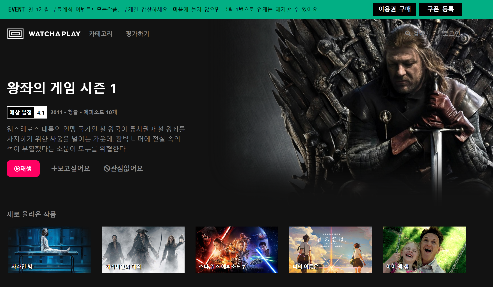
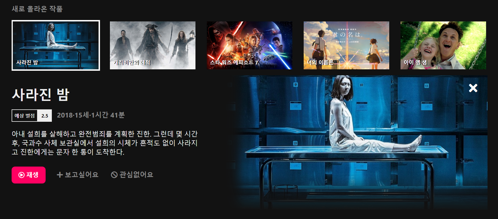
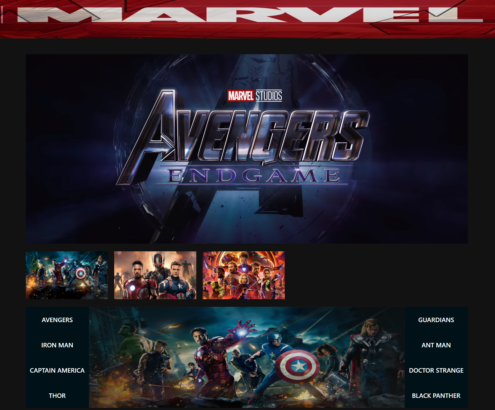
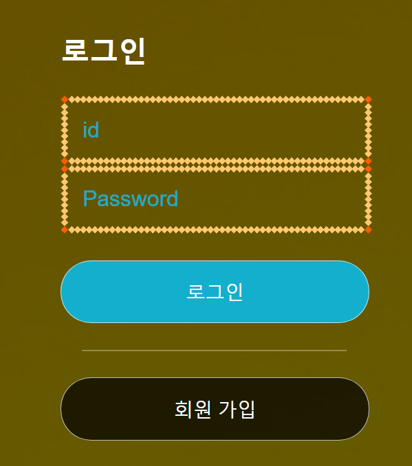
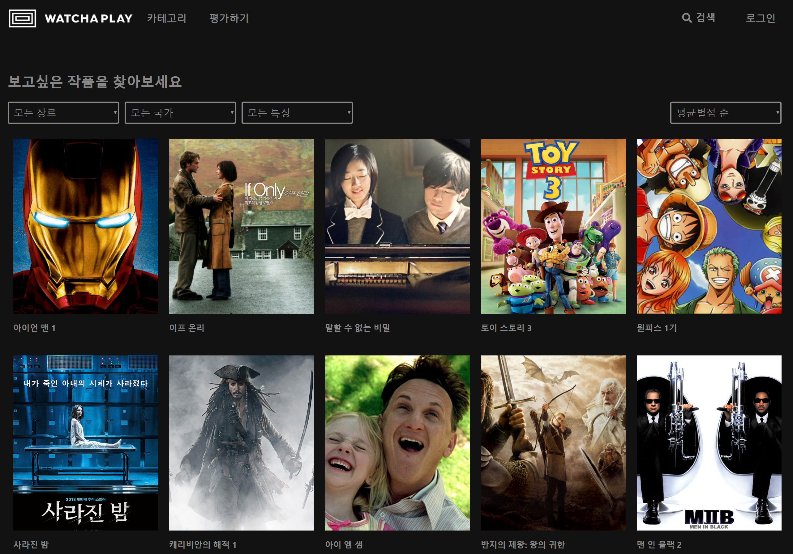
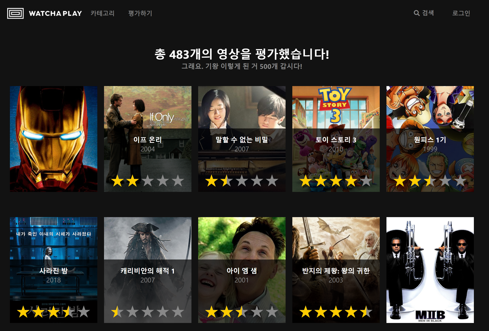
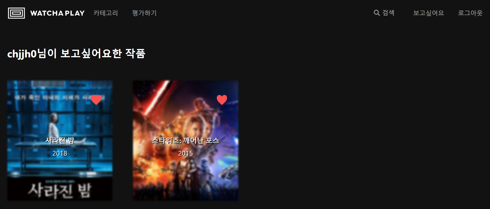
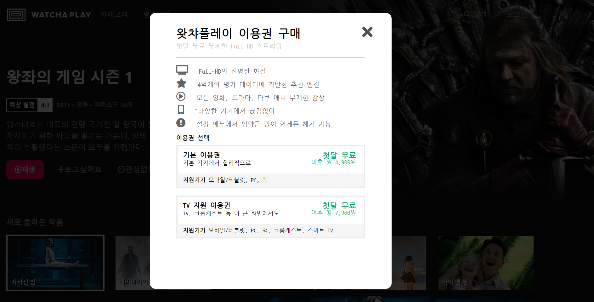

# Watcha Clone
* VOD서비스 watcha를 clone한 프로젝트입니다.
* HTML5, CSS3, jQuery, React, Redux, Node, MySQL를 활용했습니다.
* 모든 CSS는 직접 제작하였습니다.
* 프로젝트에 도입한 기능으로는 이미지 슬라이드, 팝업레이어, 무한 스크롤, 별점, 정렬 (카테고리의 최신순, 러닝타임순 )  
  iFrame, Youtube API, 회원가입, 로그인, 댓글 CRUD, 보고싶어요 (장바구니와 같은 기능) 등이 있습니다.
  
  
 # ScreenShot
 
 ■ Main page
 
 

  
 

   
 
 

  
 

   
 
 

  
 

     

■ Login page

 

  
 

     
 
■ Category page

 

  
 

   
 
■ Evaluate page

 

  
 

     

■ Favorite page

 

  
 

     
 
■ LayerPopup

 

  
 

     
